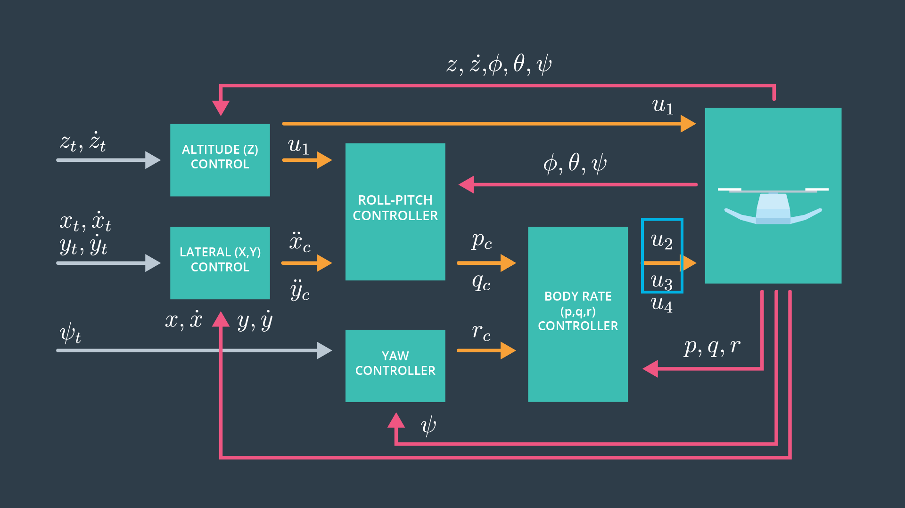

# rubric points

## 1- Body rate controller

straight forward implementation using vector form 

## 2- Roll pitch controller

slightly more challenging but was also according to the provided instructions 

it was tested using Scenario 2

## 3- Altitude controller

following the hints in the comment was important to implement this function

## 4- Lateral position

another straight forward controller, it was tested using scenario 3

## 5- Yaw controller

very simple 2 lines of code, it was also tested using scenario 3

## 6- Motor commands

had to be implemented the first, exactly like the lectures
for some reason the constraint didn't work for this controller and thrust had to be passed as is to the rotors, might need tweaking to the thrust limit in the config.

## final image when everything is working

